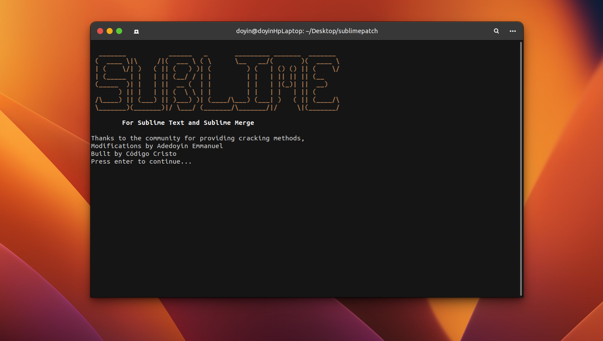
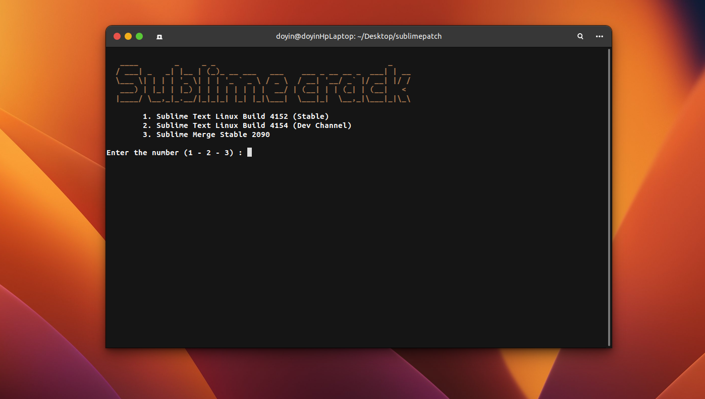
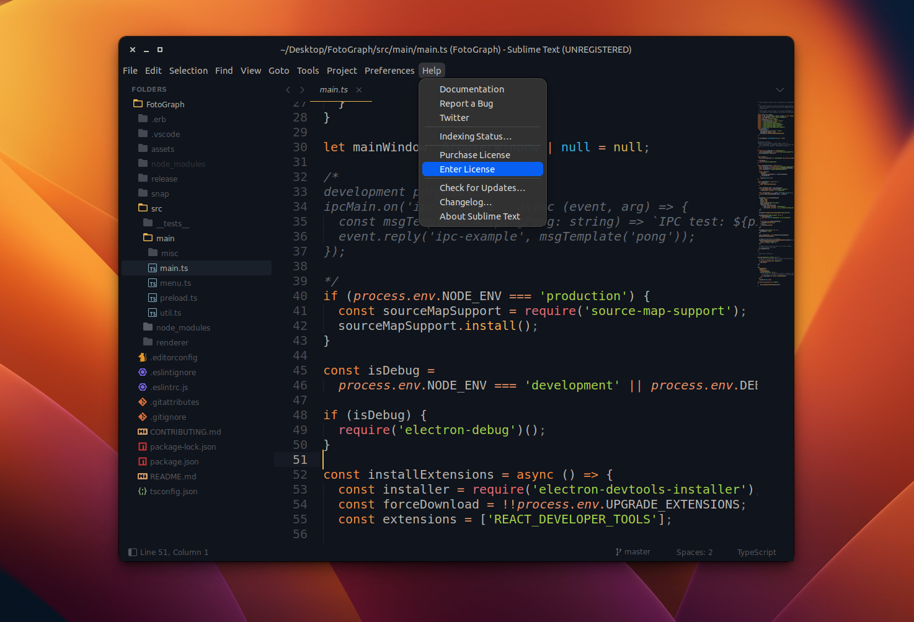
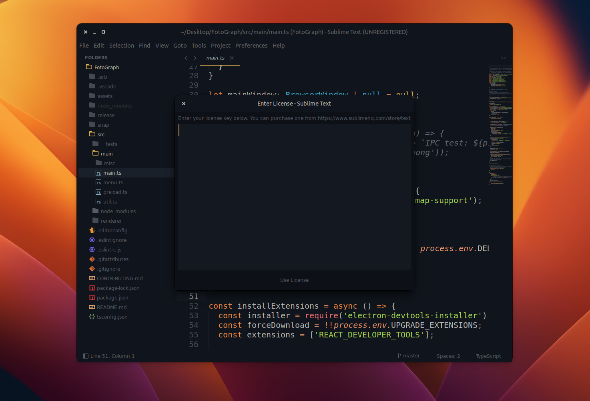
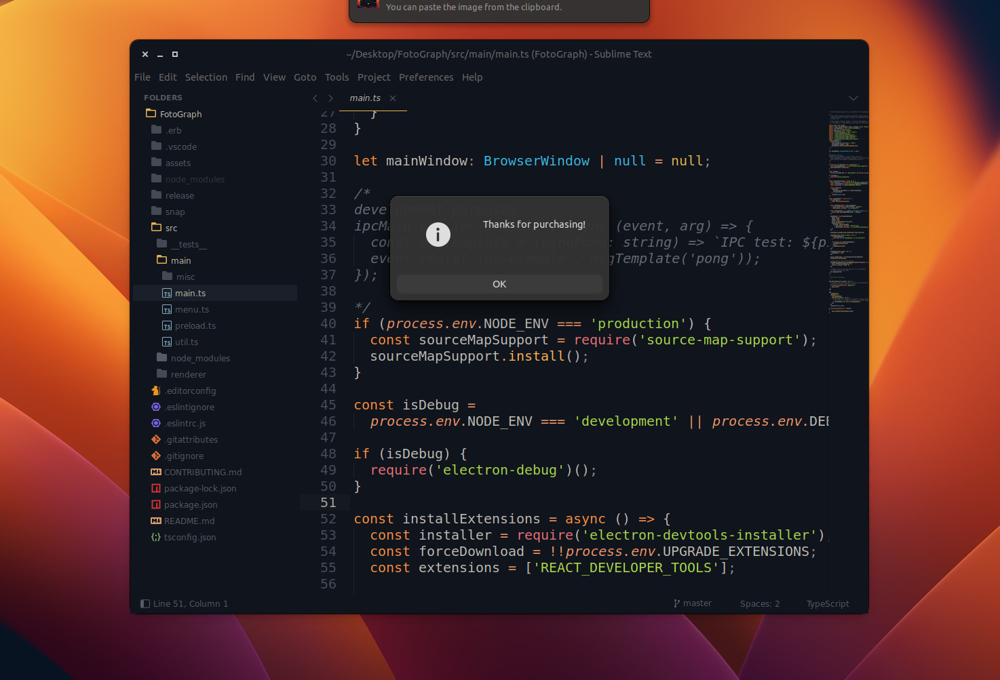

# Sublime Text Cracker 🚀

This is a simple tool that helps users crack their sublime text application. Yes, this would allow the application to accept any kind of registration key after using this tool. Sounds cool 🧢

inspired by [Código Cristo](https://github.com/CodigoCristo/sublimepatch)

## Installation ⚙️

I must mention that this tool is only available for Linux or Mac users. I might work on a Windows version in the future. Also if you installed your **Sublime Text** with **Snap** it wouldn't work 😔 why? Well apparently in span directory is read-only and cannot be tampered with. So you have to install the **Sublime Text Debian Package** using apt or manually downloading the **.deb** package here [Download Sublime Text](https://ftp5.gwdg.de/pub/linux/debian/mint/packages/pool/import/s/sublime-text/)

If you installed with Snap, remove the Snap package

```bash
sudo snap remove sublime-text
```

After downloading, open your terminal and navigate to your **/Downloads** directory

```bash
# Then run

sudo dpkg -i sublime-text_4152_amd64.deb

# that should install the sublime-text package you just downloaded

```

**To Download Using Apt**

```bash
#install the GPG key

wget -qO - https://download.sublimetext.com/sublimehq-pub.gpg | gpg --dearmor | sudo tee /etc/apt/trusted.gpg.d/sublimehq-archive.gpg > /dev/null

# Select the channel to use

# Stable
echo "deb https://download.sublimetext.com/ apt/stable/" | sudo tee /etc/apt/sources.list.d/sublime-text.list


# Dev
echo "deb https://download.sublimetext.com/ apt/dev/" | sudo tee /etc/apt/sources.list.d/sublime-text.list


# Update apt sources and install sublime-text
sudo apt-get update
sudo apt-get install sublime-text


# If this fails ensure apt is set up to work with https sources:

sudo apt-get install apt-transport-https

```

After installation, clone this repository

```bash
git clone https://github.com/Adedoyin-Emmanuel/Sublime-Text-Crack.git

cd Sublime-Text-Crack

sudo ./main


```






# Open Sublime Text 😋



Enter any text as the license text





# Enjoy The Cracked Sublime Text 🚀
